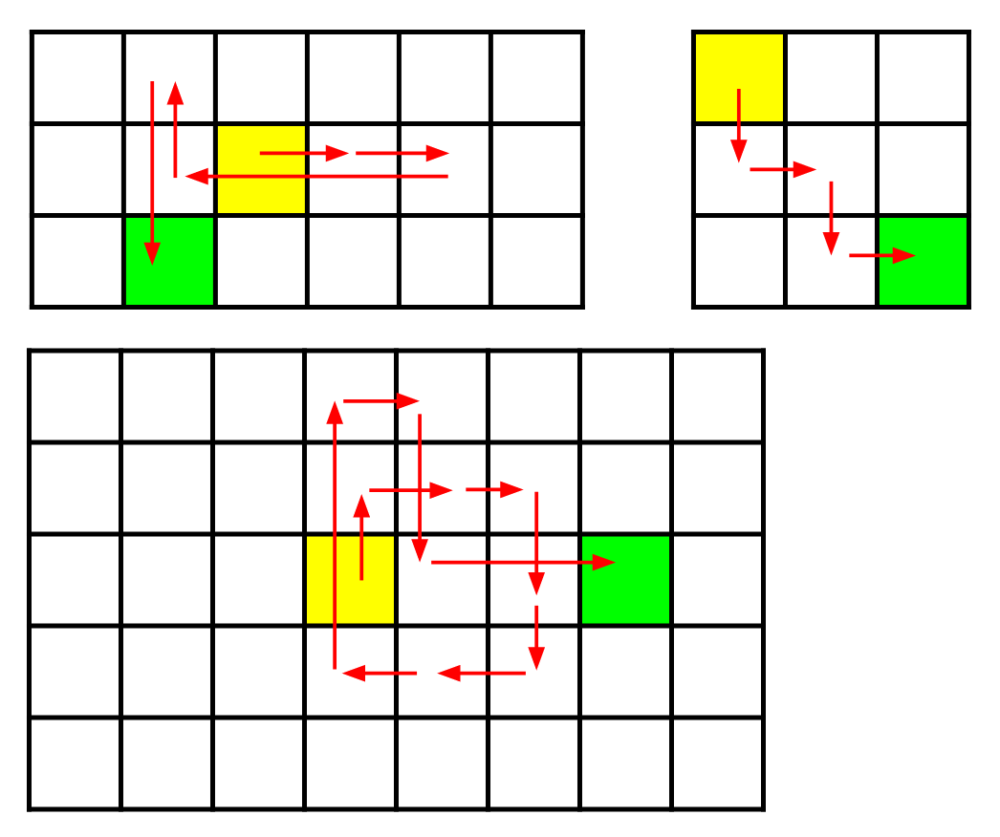

# Wiggle Walk

[Download the Starter Code!](https://codejam.googleapis.com/dashboard/get_file/AQj_6U2mpC1-THpxaaWqlUVzVnbUityULiqpnZoy12m-zdZMSg2X7FzA3gKYDUenWI-y/starter_code.zip?dl=1)

Problem
---
Banny has just bought a new programmable robot. Eager to test his coding skills, he has placed the robot in a grid of squares with R rows (numbered 1 to R from north to south) and C columns (numbered 1 to C from west to east). The square in row r and column c is denoted (r,c).

Initially the robot starts in the square (SR, SC). Banny will give the robot N instructions. Each instruction is one of N, S, E, or W, instructing the robot to move one square north, south, east, or west respectively.

If the robot moves into a square that it has been in before, the robot will continue moving in the same direction until it reaches a square that it has not been in before. Banny will never give the robot an instruction that will cause it to move out of the grid.

Can you help Banny determine which square the robot will finish in, after following the N instructions?

Input
---
The first line of the input gives the number of test cases, T. T test cases follow. Each test case starts with a line containing the five integers N, R, C, SR, and SC, the number of instructions, the number of rows, the number of columns, the robot's starting row, and the robot's starting column, respectively.

Then, another line follows containing a single string consisting of N characters; the i-th of these characters is the i-th instruction Banny gives the robot (one of N, S, E, or W, as described above).

Output
---
For each test case, output one line containing Case #x: r c, where x is the test case number (starting from 1), r is the row the robot finishes in, and c is the column the robot finishes in.

Limits \
Memory limit: 1 GB.  
1 ≤ T ≤ 100.  
1 ≤ R ≤ 5 × 10^4.  
1 ≤ C ≤ 5 × 10^4.  
1 ≤ SR ≤ R.  
1 ≤ SC ≤ C.  
The instructions will not cause the robot to move out of the grid.

Test Set 1 \
Time limit: 20 seconds.  
1 ≤ N ≤ 100.

Test Set 2 \
Time limit: 60 seconds.  
1 ≤ N ≤ 5 × 10^4.

Sample
<table>
<tr>
<th>Sample Input</th>
<th>Sample Output</th>
</tr>
<tr>
<td>
  
```
3
5 3 6 2 3
EEWNS
4 3 3 1 1
SESE
11 5 8 3 4
NEESSWWNESE
```
  
</td>
<td>

```
Case #1: 3 2
Case #2: 3 3
Case #3: 3 7
```

</td>
</tr>
</table>

Sample Case #1 corresponds to the top-left diagram, Sample Case #2 corresponds to the top-right diagram, and Sample Case #3 corresponds to the lower diagram. In each diagram, the yellow square is the square the robot starts in, while the green square is the square the robot finishes in.



## Coding Practice with Kick Start Session #3. [Source](https://codingcompetitions.withgoogle.com/kickstart/round/00000000008f49d7/0000000000bcf0fd)
